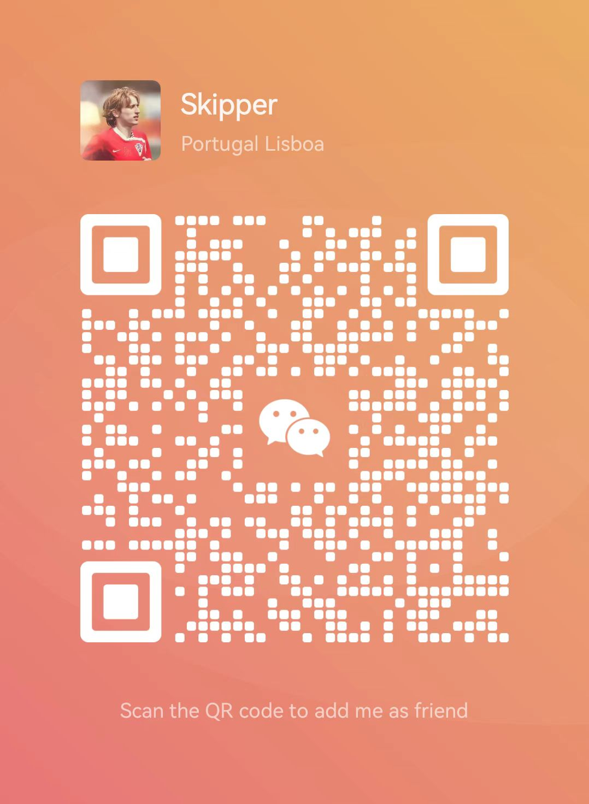

<!-- ˗ˋˏ ♡ ˎˊ˗ 博客头部 ˗ˋˏ ♡ ˎˊ˗ -->
# 🎯 欢迎来到复旦姜同学的博客

 <!-- 替换为你的萌系横幅图 -->

  ☁️
  

    <a href="https://www.example.com" target="_blank" title="访问示例网站">高中生学习资料</a>
  

  

    <a href="https://www.example.com" target="_blank" title="访问示例网站">计算机学习资料</a>
  

  

    <a href="https://www.example.com" target="_blank" title="访问示例网站">心理学与社会学资料</a>
  

  

    <a href="https://www.example.com" target="_blank" title="访问示例网站">考公考研求职创业资料</a>
  

  

    <a href="https://www.example.com" target="_blank" title="访问示例网站">(๑˃̵ᴗ˂̵)و*✧･ﾟ:* ✧･ﾟ</a>
  

<!-- ˗ˋˏ ♡ ˎˊ˗ 正文内容 ˗ˋˏ ♡ ˎˊ˗ -->

## 🎨 关于我

- 🏫 复旦大学计算机系在读硕士生，人工智能与数据科学方向，本科有系统安全学习背景
- 💡 读书写作、科研技术、运动健身、教育科普、创业搞钱，争做新时代斜杠青年
- 🧩 ENFP、皇马球迷、二次元但不宅、研一GAP创业、喜欢音乐写作绘画

## 🐾 教育经历
<!-- 用颜色标签突出重点 -->
- 临清市京华中学 中考第9名 2014-2017
- 临清市第一中学 高考第5名 2017-2020
- 复旦大学 信息安全 2020-2024
- 复旦大学 计算机科学与技术（保研） 2024-至今

## 📱 自媒体
- 抖音：[复旦姜同学-学习成长笔记](https://v.douyin.com/i5S7LUPV/)
- 小红书生活号：[LongLiveLiam文化生活](https://www.xiaohongshu.com/user/profile/608bfa4e000000000101e1de?xsec_token=YBQITsoKiuEwq39wob2n32iUOwu9tvr7B8bEQgQE3huxY%3D&xsec_source=app_share&xhsshare=CopyLink&appuid=608bfa4e000000000101e1de&apptime=1740830527&share_id=0489d8144e034b3c808585b45e7762fc&share_channel=copy_link)
- 小红书知识号：[阿唯的知识小铺](https://www.xiaohongshu.com/user/profile/627e5387000000002102916b?xsec_token=YBRradLbHlXgvi0EoTujMFtKKO4OFGI84BWmBkRqWxfzo%3D&xsec_source=app_share&xhsshare=CopyLink&appuid=608bfa4e000000000101e1de&apptime=1740830976&share_id=bf8b3b10993147fbbec0aebf56266900&share_channel=copy_link)
## 🎯 内容方向
- 📝 高中学习计划与思维建设
- ⏳ 心理学与社会学知识分享
- 💻 人工智能与计算机领域科普

## 🍄 未来清单
- [x] 有自己的线下店
- [ ] 自媒体破万粉
- [ ] 雅思考试
- [ ] 国家二级心理咨询师
- [ ] E级足球教练

## 🌰 扫码添加微信
#### 姜同学个人微信

#### 高中生学习思维分享群

#### 大学生朋友们的一站式信息中心

#### AI-数据科学-基础架构-计算机技术
